WayEase – Travel Planner Web App

WayEase is a web application that helps users explore places, plan trips, and maintain a personal travel diary.

---

Features

Authentication
- User signup and login
- Google sign-in
- Mobile OTP login

Explore Places
- Browse places by city (Delhi, Mumbai, Bangalore, etc.)
- Category-based filtering
- Map view integration

Wishlist
- Save favorite places
- View and manage wishlist

Reviews and Photos
- Add reviews for places
- Upload images

Trip Planner
- Generate itinerary based on:
  - Number of days
  - Budget
  - Time and preferences
- Download itinerary

Travel Diary
- Maintain a virtual travel diary
- Store personal experiences

---

Screenshots

Home Page 

Authentication Page
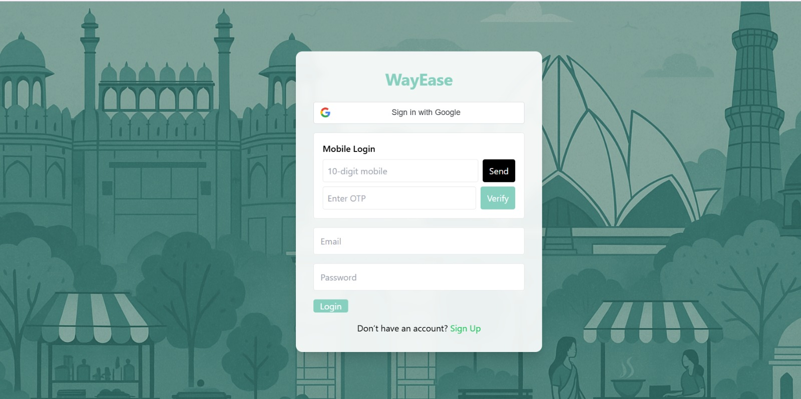

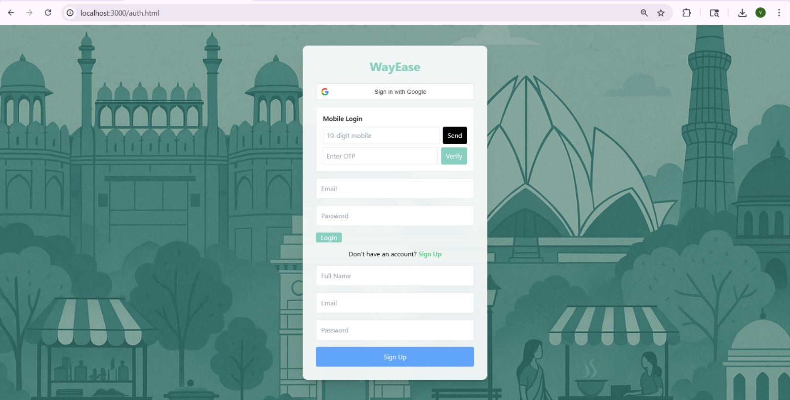

Home Page
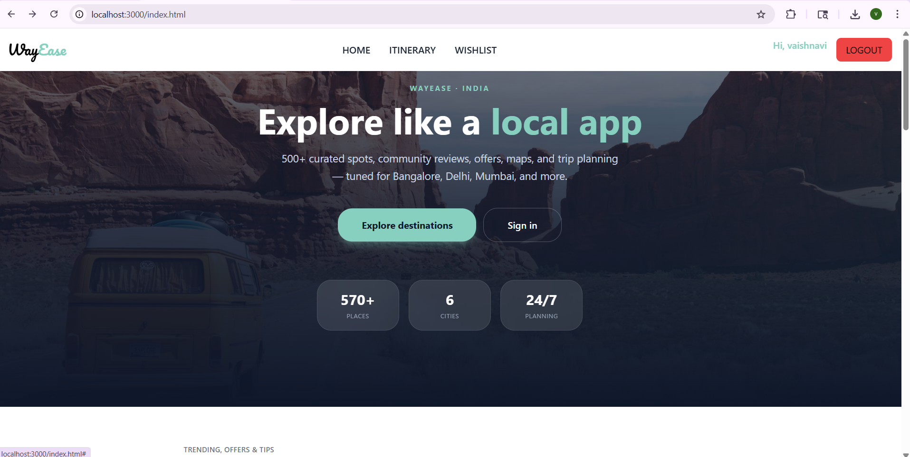

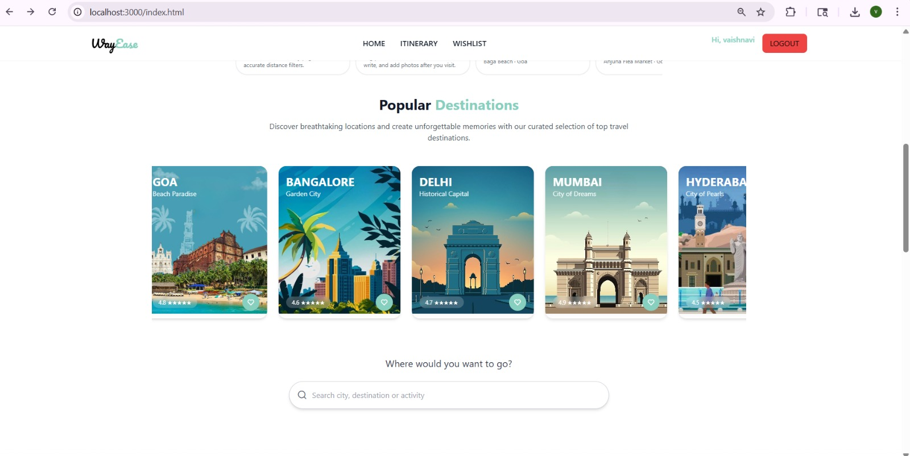

Itinerary 
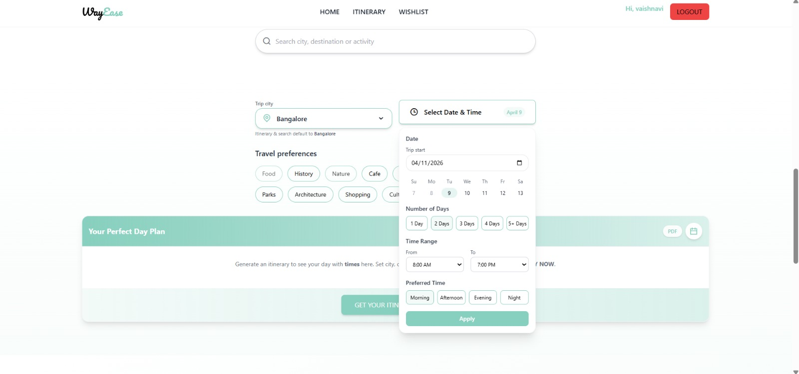

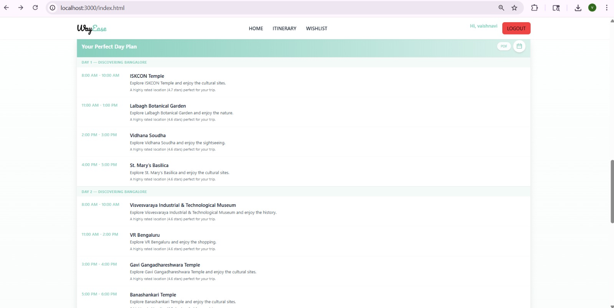

Planner
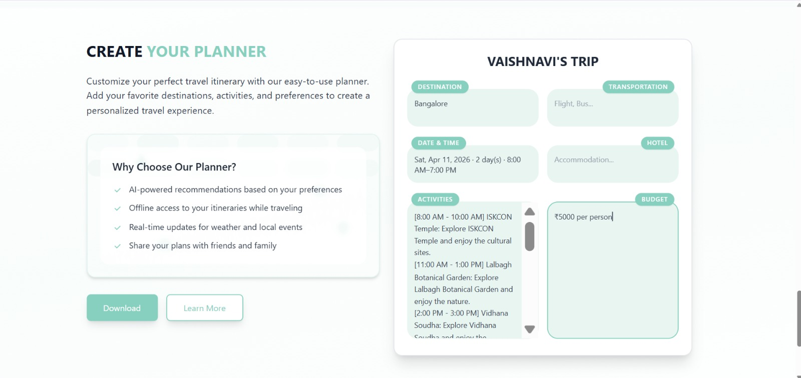

City Page
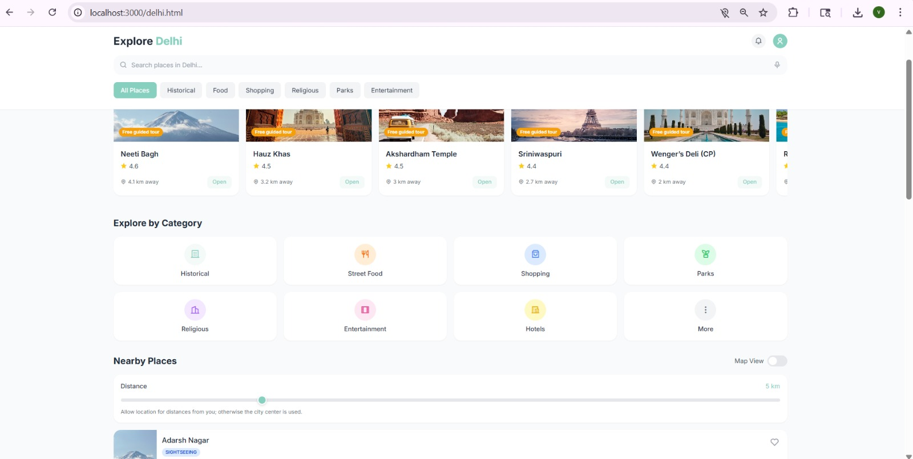

Places Page
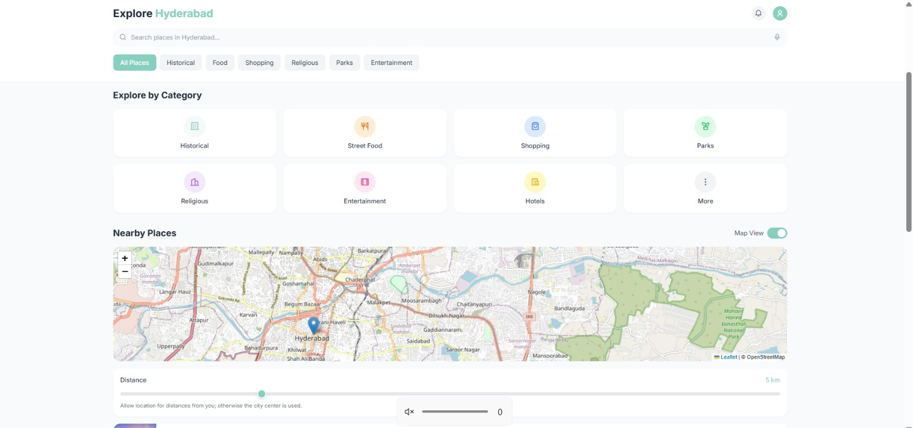

Wishlist
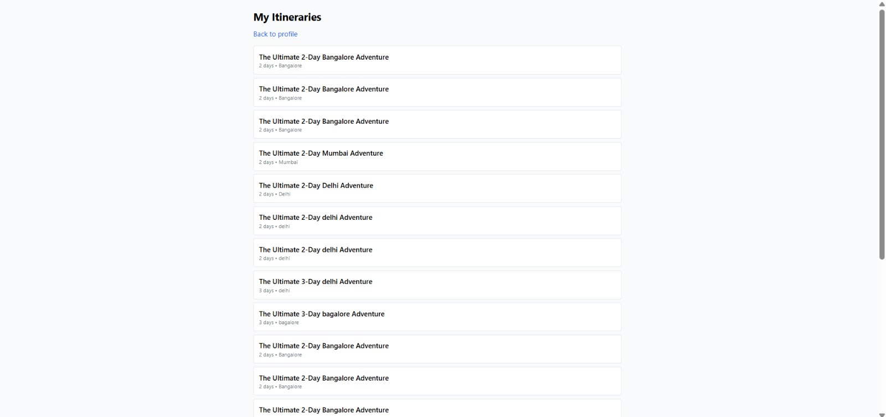

Itinerary Planner

Virtual diary 
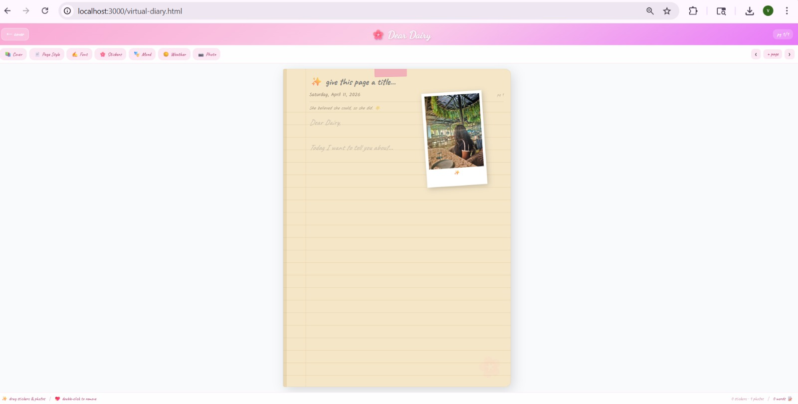

---

Tech Stack

- Frontend: HTML, CSS, TailwindCSS, JavaScript
- Backend: Node.js, Express.js
- Database: LowDB / JSON
- Authentication: JWT, Google OAuth, Firebase OTP
- APIs: Maps, Places API

Demo Video

[Watch Demo](https://youtu.be/wn8DlTcHTB4)
